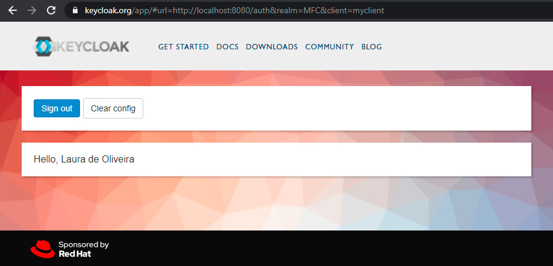

# Desafio 2

- Realizar o [Get Started](https://www.keycloak.org/getting-started/getting-started-docker) do Keycloak.
- Criar um novo realm e um user, e utilizar como client a [SPA disponibilizada](https://www.keycloak.org/app/).
- Autenticar usuário criado na SPA.

## Solução

 ***Usuário autenticado*** :sunglasses:
